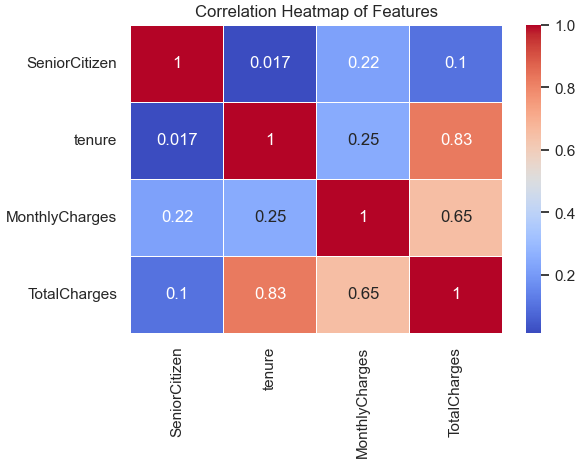
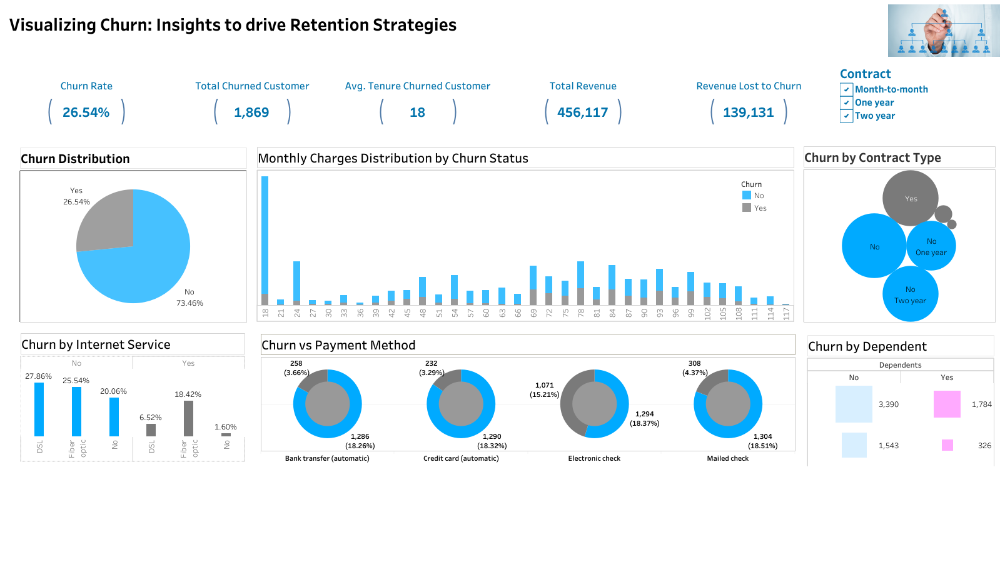

# Teleco-Churn-Analysis
Customer churn analysis using SQL, Python, and Tableau)


---
## Project Overview
This project analyzes customer churn patterns in a telecom company using SQL, Python, and Tableau. By identifying churn factors, the analysis provides actionable insights for improving customer retention strategies. Additionally, predictive modeling was employed to anticipate at-risk customers, enabling targeted interventions.

**_ Disclaimer_** : _All datasets and reports do not represent any company, institution or country, but just a dummy dataset to demostrate my proficiency in Data Analysis tools._

## Table of Contents
- [Objectives](##objectives)
- [Tools and Technologies](##tools-and-technologies)
- [Skills/Concept Demostrated](##skill/concept_demostrated)
- [SQL Analysis](###1_sql_analysis)
- [SQL Key Insigts](#####7_key_insights)
- [Python Analysis](##python_analysis)
- 


## Objectives
1. Understand customer churn drivers and patterns.
2. Build dashboards and KPIs to track churn metrics.
3. Develop predictive models to identify high-risk customers.

## Tools and Technologies
1. SQL: Data extraction, cleaning, and aggregation.
2. Python: Advanced statistical analysis and visualization.
2. Tableau: Dashboards for interactive insights.

## Skill/Concept Demostrated

### 1. SQL Analysis
- Data Exploration: Understand the structure and quality of the dataset.
- Data Cleaning: Address missing or inconsistent data values.
- Descriptive Analytics: Summarize key trends in the dataset.
- Correlation Analysis: Identify relationships between numerical variables.
- Churn Analysis: Explore customer churn trends based on demographics and contract types.

#### SQL Workflow
##### 1. Database Setup
- Database Created: TelecommChurn
- Table Used: telecomm_customer
 - Schema Verification: Confirmed table structure using DESCRIBE.
##### 2. Data Exploration
- Performed initial checks on data quality and distribution:
- Verified row counts and presence of null values in critical columns.
- Explored categorical variables like Gender, Contract, and PaymentMethod.
- Analyzed churn distribution and customer demographics.

#### Key Queries:
- Count of rows and non-null values.
- Distribution of Gender, Churn, and Contract.
- Frequency of PaymentMethod and other categorical fields.

##### 3. Data Cleaning
- Handled inconsistencies and missing data:
- Standardized the Churn column to numeric values (1 for Yes, 0 for No).
- Checked for invalid or missing entries in TotalCharges and MonthlyCharges.
- Verified updates to Churn column using sample records.

##### 4. Descriptive Analytics
- Generated summary statistics for numerical variables:
- Metrics such as minimum, maximum, average, and standard deviation were calculated for:
- SeniorCitizen
- Tenure
- MonthlyCharges
- TotalCharges
###### Highlights:
- Distribution of MonthlyCharges and TotalCharges was reviewed.
- Identified frequently occurring MonthlyCharges values.

##### 5. Correlation Analysis
-Calculated the Pearson correlation coefficient between:
MonthlyCharges and TotalCharges.

##### 6. Churn Analysis
Explored churn trends based on demographics and contract types:

- Churn distribution across:
- SeniorCitizen status.
- Partner status.
- Contract types.
- Relationship between churn status and:
- MonthlyCharges.
- Tenure.

##### 7. Key Insights
Churn Rate:
- A significant proportion of churn is observed among customers with shorter tenure and higher monthly charges.
###### Demographics:
- Senior citizens are more likely to churn compared to younger customers.
- Customers without partners showed a higher churn rate.
###### Contracts:
- Month-to-month contracts are associated with higher churn rates compared to long-term contracts.
###### Correlation:
-A strong positive correlation exists between MonthlyCharges and TotalCharges.

_SQL Query Snippet:_
```
_-- Correlation between MonthlyCharges and TotalCharges_
 _-- Using the Pearson Correlation Formular [between MonthlyCharges and TotalCharges]_

_SELECT
    (COUNT(*) * SUM(MonthlyCharges * TotalCharges) - SUM(MonthlyCharges) * SUM(TotalCharges)) /
   
    (SQRT(COUNT(*) * SUM(POW(MonthlyCharges, 2)) - POW(SUM(MonthlyCharges), 2)) *
    
     SQRT(COUNT(*) * SUM(POW(TotalCharges, 2)) - POW(SUM(TotalCharges), 2))) AS Correlation
FROM telecomm_customer;_
```
View The Complete SQL Code Here: [(MySQL Telocomm Project  Analysis.sql](https://github.com/Michael-Otebola/Teleco-Churn-Analysis/blob/334513e23c12272b3f9bb8d1921d27cd74d072ae/MySQL%20Telocomm%20Project%20%20Analysis.sql))

_The correlation between MonthlyCharges and TotalCharges is 0.6511, indicating a moderate to strong positive relationship. As MonthlyCharges increase, TotalCharges also tend to rise proportionally, It means that customers who pay higher monthly charges are likely to have higher total charges over time. This suggests a direct link between how much a customer is billed each month and their overall spending with the company._

## Python Analysis
#### 1. Exploratory Data Analysis (EDA):

- Churn Rate: Identified that 26.54% of customers in the dataset had churned, providing a baseline understanding of the churn rate.
- Correlation Analysis: Generated a heatmap to examine relationships between features. Found strong correlations between MonthlyCharges and TotalCharges, as well as insights on tenure and churn tendencies.
#### 2. Statistical Insights:

###### - Demographic Influence:
- Senior citizens had a higher likelihood of churn compared to non-senior citizens.
- Customers with dependents or partners were less likely to churn.
###### - Service-Based Insights:
- Customers using fiber optic internet services were more prone to churn than those using DSL or no internet service.
- Add-on services like online security and tech support were associated with reduced churn rates.
###### - Contract Type:
Customers with month-to-month contracts showed significantly higher churn rates compared to those on one-year or two-year contracts.
#### 3. Data Visualization:

- Used Seaborn and Matplotlib to create:
- Bar Charts: Highlighting churn rates across demographics and services.
- Box Plots: To display the distribution of MonthlyCharges and TotalCharges across churned and non-churned customers.
- Heatmap: Showcased the correlation matrix for numerical variables.
#### 4. Predictive Analysis:

###### - Initial Logistic Regression Model:
- Achieved an accuracy of 81.9%, with a strong performance in predicting non-churners (precision: 86%, recall: 91%).
- Identified class imbalance, with weaker predictions for churners (precision: 69%, recall: 58%).
###### - Improved Logistic Regression Model with Balanced Weights:
- Adjusted for class imbalance, resulting in improved recall for churners (83%) at the cost of overall accuracy (74.5%).
- Precision for churners increased to 51%, providing a more actionable model for identifying potential churners.

   _Python Code Snippet:_
```
   # Select only numeric columns for correlation
numeric_columns = df.select_dtypes(include=['float64', 'int64'])
###### Check the selected columns
print("Numeric Columns:\n", numeric_columns.columns)

Numeric Columns:
 Index(['SeniorCitizen', 'tenure', 'MonthlyCharges', 'TotalCharges'], dtype='object')
###### Correlation heatmap

plt.figure(figsize=(6, 4))
correlation_matrix = numeric_columns.corr()  # Calculate the correlation matrix
sns.heatmap(correlation_matrix, annot=True, cmap='coolwarm', linewidths=0.5)
plt.title('Correlation Heatmap of Features')
plt.show()
Numeric Columns:
 Index(['SeniorCitizen', 'tenure', 'MonthlyCharges', 'TotalCharges'], dtype='object')
```



Click Here To View Complete Python Code: [https://github.com/Michael-Otebola/Teleco-Churn-Analysis/blob/1224ede081112fd234e7f7ddc9144ac4cee6ec02/Telecom_Customer_Churn_Analysis%20.ipynb]

Key Insights: Tenure is highly correlated with total charges (0.83):
Customers who stay longer will naturally have higher total charges. This is an important feature to consider when analyzing or predicting churn.
Monthly charges moderately correlate with total charges (0.65):
Higher monthly charges contribute significantly to total charges.
Weak or negligible correlations for SeniorCitizen:
Being a senior citizen does not strongly influence tenure, monthly charges, or total charges.

### - Key Findings:

- High monthly charges are linked to higher churn rates.
- Month-to-month contracts and fiber optic services are significant drivers of churn.
- Customers with longer tenure and bundled services are less likely to churn.


## Tableau Visualizations
The Tableau dashboard provided insights into customer churn through various KPIs and visualizations, helping to identify key drivers of churn and areas for business improvement.


#### Key Performance Indicators (KPIs)
- Churn Rate: The percentage of customers who have churned, providing a quick overview of the churn problem.
- Total Churned Customers: The total number of customers who have left, offering a context of the scale of churn.
- Average Tenure of Churned Customers: This shows the average length of time churned customers had been with the company, helping identify potential areas for customer retention efforts.
- Total Revenue: The overall revenue generated, used to measure the financial scale of the business.
- Revenue Lost to Churn: The revenue lost due to churned customers, an important metric to quantify the financial impact of churn.

#### Main Dashboard Visualizations
- Churn Distribution (Pie Chart)
Visualized the distribution of churned vs. non-churned customers, giving an immediate sense of the churn problem.

- Monthly Charges Distribution by Churn (Horizontal Bar Chart)
Displayed the distribution of monthly charges among churned and non-churned customers, helping to identify whether higher charges correlate with churn.

- Churn by Contract Type (Packed Bubbles)
Showed the relationship between churn and different contract types, highlighting that month-to-month contracts have higher churn rates than longer-term contracts.

- Churn by Internet Service (Scatter Plot)
Provided insight into how different types of internet services (Fiber optic, DSL, etc.) relate to churn, showing that fiber optic users tend to have higher churn rates than others.

- Churn vs. Payment Method (Donut Chart)
This donut chart visualized churn rates across various payment methods, with electronic checks showing higher churn rates compared to other payment methods like automatic bank transfers.

- Churn vs. Dependent (Heat Map)
Illustrated churn rates based on whether customers had dependents or not, helping to explore if dependents influence churn behavior.

Use This Link to Interract with The Viz: [https://public.tableau.com/views/TelecomCustomerChurn_17326272284860/Visualization?:language=en-US&:sid=&:redirect=auth&:display_count=n&:origin=viz_share_link]

#### Key Insights from Visualizations
- Contract Type: Month-to-month customers were significantly more likely to churn, suggesting that offering longer-term contracts may help reduce churn.
- Revenue Impact: Higher monthly charges were often associated with churned customers, indicating the need for a deeper investigation into the pricing structure.
- Payment Methods: Electronic checks showed a strong correlation with higher churn, indicating that payment method choices might be an area for customer retention strategies.
- Service Type: Customers with fiber optic internet services had higher churn rates, suggesting a potential need for improving service delivery or pricing for this group.

 ###  Overall Insights, Recommendations, and Conclusions
 ---
#### Insights
###### Churn Behavior:
- Customers on month-to-month contracts have the highest churn rates, suggesting a lack of commitment compared to annual or two-year contracts.
- Higher monthly charges are correlated with higher churn, potentially indicating pricing sensitivity.
- Payment methods like electronic checks showed a higher churn rate, possibly due to convenience or trust issues.

###### Customer Demographics:
- Customers without dependents and those who are senior citizens churn more often, indicating potential dissatisfaction or unmet needs among these groups.

###### Service Insights:
- Fiber optic internet users tend to churn more than DSL or no internet service users, potentially due to performance or pricing concerns.

###### Financial Impact:
- The company is losing a significant portion of revenue due to churn, emphasizing the need for targeted retention strategies.

#### Recommendations
###### Retention Strategies:
- Incentivize long-term contracts through discounts or added benefits to reduce churn from month-to-month customers.
- Introduce personalized offers for high-risk groups such as senior citizens or single individuals to improve satisfaction and loyalty.

###### Pricing Adjustments:
- Reevaluate the pricing structure, especially for customers on higher monthly charges. Consider value-based pricing or bundling services.
###### Payment Method Improvements:
- Encourage customers to use automatic bank transfers or credit card payments by offering incentives like discounts or loyalty points.

###### Service Quality:
- Conduct a deep dive into fiber optic service complaints to identify and address service gaps that lead to dissatisfaction.

###### Data-Driven Decisions:
- Implement machine learning models in production for real-time churn prediction and proactive intervention.

---
**_Conclusions_**

_The analysis using SQL, Python, and Tableau has revealed critical areas where the company can reduce churn and improve customer retention. By addressing factors like contract types, pricing, and service quality, the business can mitigate churn's financial and operational impacts. A continued focus on data-driven decision-making will allow for sustainable growth and improved customer satisfaction._

##### Acknowledgments
This project was made possible through:

The availability of the Telecom Customer Dataset.
Support from data analysis tools such as SQL, Python, and Tableau.
Inspiration from academic and professional data analysis practices.
Thank you to all contributors who helped refine the project’s methodology and outcomes.

##### Future Work
**Advanced Modeling:**

- Explore ensemble methods like Random Forests or Gradient Boosting to improve churn prediction accuracy.
- Implement real-time prediction systems integrated into the company’s CRM for immediate action.

**Customer Segmentation:**
Develop a segmentation strategy to tailor offers and services to different customer groups based on churn likelihood.

**Customer Feedback Integration:**
Use sentiment analysis from customer feedback to identify pain points and proactively resolve issues.

**New Metrics:**
Introduce additional KPIs such as customer lifetime value (CLV) and customer acquisition cost (CAC) to complement churn analysis.

**Automation and Scaling:**
Automate the pipeline for data cleaning, analysis, and visualization for scalability and faster insights delivery.

#### How to Use This Report
**SQL Section:**
- Use the provided SQL queries to explore and clean customer data, identify key trends, and calculate descriptive statistics.

  **Python Section:**
- Run the Python scripts for predictive analysis, including logistic regression models for churn prediction.

  **Tableau Dashboards:**
- Open the Tableau workbook to interact with visualizations and gain quick insights into churn dynamics.

**Business Application:**
- Translate insights into actionable strategies, focusing on pricing, contracts, and service improvements.

## Thank You
_Thank you for taking the time to review this comprehensive churn analysis. Your feedback and suggestions are greatly appreciated. We hope this work sparks ideas for improving customer retention and advancing data-driven decision-making in your organization._

Feel free to reach out for collaboration or further exploration of these findings.

#### Happy Analyzing!


